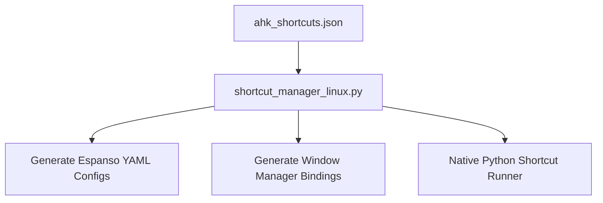

# Linux Shortcut Migration Plan: Native Tools

This plan details how to migrate the existing AutoHotkey (AHK) shortcut management system from Windows to native, cross-platform, or Linux-native tools.

Instead of running AutoHotkey on Linux via Wine, we will map AHK's functionality to native Linux tools using the existing JSON data structure (`ahk_shortcuts.json`).

---

## 🛠️ Tool Mapping Strategy

| AHK Feature | Linux Equivalent | Description |
| :--- | :--- | :--- |
| **Hotstrings / Text Shortcuts** | **Espanso** or **AutoKey** | **Espanso** (YAML-based, works on X11 & Wayland) is excellent for simple text replacements. **AutoKey** supports Python scripting for complex text paste hooks. |
| **Launchers / Script Shortcuts** | **Native Window Manager Hotkeys** (+ **xdotool** / **ydotool**) | Bind keys using your Desktop Environment (GNOME, KDE) or Window Manager (i3, Sway) config to execute Python command-line tasks directly. |
| **Key Remaps** | **Kanata** or **input-remapper** | **input-remapper** provides a modern GUI to easily remap keys, while **Kanata** offers robust, cross-platform config files (similar to AHK's remapping). |
| **Window Filters (`#HotIf`)** | **Espanso App-Specific Rules** / **Python active-window checks** | Restrict shortcuts to specific active applications by querying window properties via standard window system APIs (`xdotool getactivewindow` or `qtile` / `sway` IPC). |

---

## 📋 Implementation Architecture

We can write a Linux-native python daemon or tool parser (`shortcut_manager_linux.py`) that reads the existing [ahk_shortcuts.json](file:///home/nahid/@delta/ms1/@AutoHotKey/shortcut_manager/ahk_shortcuts.json) and dynamically configures or hooks the shortcuts natively.



### 1. Text Expansion (Espanso Integration)
The parser can read the `"text_shortcuts"` from the JSON and output them directly into an Espanso configuration package (e.g. `~/.config/espanso/match/generated.yml`):

```yaml
# Espanso auto-generated format
matches:
  - trigger: ";v2"
    replace: "#Requires AutoHotkey v2.0"
  
  - trigger: ";v1"
    replace: "#Requires AutoHotkey v1.0"
```

### 2. Launchers and Scripts (Python Runner)
For launchers and Python scripts, we can run a simple, lightweight system shortcut daemon (like `xbindkeys` on X11 or a native systemd user service), or generate native desktop-shortcut key bindings that run a Python entrypoint to execute actions.

---

## ⚡ Wayland & Modern Linux Input Stack

Wayland implements security features that block traditional X11 tools (like `xdotool` and `xbindkeys`) from intercepting or injecting global key events. The updated tool map for X11 vs. Wayland is:

| AHK Concept | X11 Tool | Wayland Tool | Kernel / Display-Server Agnostic (Recommended) |
| :--- | :--- | :--- | :--- |
| **Hotstrings (Text Expansion)** | `AutoKey` | `Espanso` | **Espanso** |
| **Key Remaps** | `xmodmap` / `setxkbmap` | Compositor config | **`keyd`** or **`Kanata`** (device-level input remappers) |
| **Input Emulation** | `xdotool` | `wtype` | **`ydotool`** (writes directly to `/dev/uinput`) |
| **Global Hotkey Launchers** | `xbindkeys` | Compositor config | **Compositor Bindings** (GNOME/KDE Custom Shortcuts, Sway/Hyprland config) |

---

## 🧠 Complex Scripting on Linux

For complex scripting tasks (involving conditional logic, loops, window titles, or API requests), use these native Linux approaches:

### Option A: AutoKey (Python-Integrated Scripting)
Best for X11 setups. AutoKey uses standard **Python** as its scripting engine.
*   **Why use it**: Access the entire Python library ecosystem while using built-in automation calls like `keyboard.send_keys()`, `mouse.click()`, and `window.wait_for_focus()`.
*   **Example**:
    ```python
    import urllib.request, json
    response = urllib.request.urlopen("https://api.exchangerate/usd")
    data = json.loads(response.read())
    rate = data['rates']['EUR']
    keyboard.send_keys(f"Current EUR rate: {rate}")
    ```

### Option B: Standalone Python Scripts + Compositor Hotkeys
Best for Wayland setups. Since Wayland compositors isolate processes, map keys directly inside the desktop environment (GNOME, KDE) or window manager (Sway, Hyprland) config to trigger standalone Python scripts.
*   **Why use it**: Most robust way on modern Linux. Use python packages like `pyautogui` or system utilities like `ydotool` and `wl-clipboard` (for clipboard management) to control interactions.

---

## 🚀 Next Steps

1. **Verify Window System**: Confirm if you are currently running **Wayland** or **X11** (run `echo $XDG_SESSION_TYPE` in terminal).
2. **Tool Selection**: Agree on the preferred backend for keyboard mapping (e.g., `keyd` vs `Kanata`) and text expansion (`Espanso` vs `AutoKey`).
3. **Write Compiler Script**: Create a script `compile_shortcuts.py` that processes `ahk_shortcuts.json` and outputs active configurations for the chosen Linux backends.
