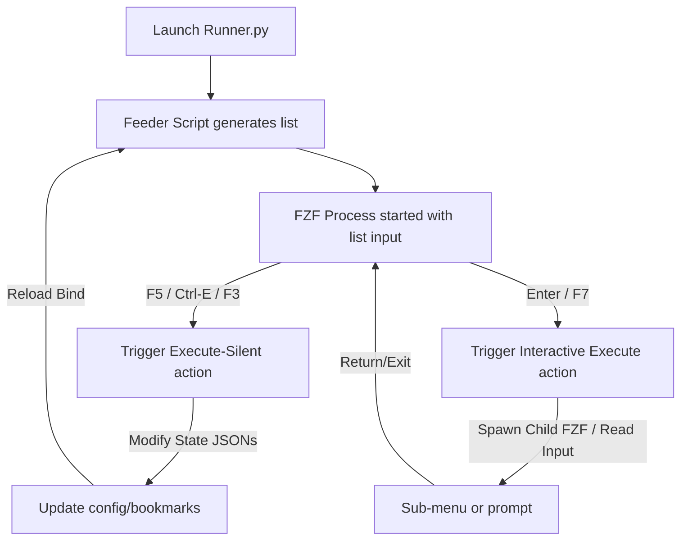

# FZF-Based Terminal Application Design Guide

This guide details the architectural patterns, terminal control tricks, and interactive workflows used in our **FZF Launcher & Runner** application. You can use these patterns to build fast, keyboard-driven, 100% terminal-based apps in Python.

---

## 1. Core Architecture

The application uses **FZF (Fuzzy Finder)** as the primary UI layer and **Python** as the state coordinator. FZF handles typing, filtering, rendering, and hotkeys, while Python generates content and processes actions.



---

## 2. Key Architectural Patterns

### Pattern A: Dynamic Live Reloading (`reload` Bind)
Instead of starting and stopping FZF to update listings, we bind hotkeys to run state-modifying python commands and reload FZF dynamically.

#### Code Pattern:
```python
fzf_args = [
    "fzf",
    f"--bind=ctrl-e:execute-silent(python runner.py --toggle-collapse {{2}})+reload(python feeder.py)",
    f"--bind=f3:reload(python feeder.py --toggle-view)"
]
```
* **`execute-silent(...)`** runs a Python subcommand in the background without clearing the terminal screen or outputting stdout.
* **`+reload(...)`** triggers FZF to rerun the feeder script and refresh the active screen list inline instantly, keeping the user's cursor position.

---

### Pattern B: Interactive Sub-Shells (`execute` Bind)
When a task requires user input (e.g. typing a name, choosing from a list, or navigating directories), we temporarily pause the main FZF window, run an interactive Python command, and return.

#### Code Pattern:
```python
fzf_args = [
    "fzf",
    f"--bind=f7:execute(python runner.py --configure)+reload(python feeder.py)"
]
```
* **`execute(...)`** (without `-silent`) clears the screen and hands full control of the terminal's stdin/stdout to the Python process.
* Once the Python process exits, FZF restores its display and runs the reload command to fetch updated files/settings.

---

### Pattern C: Nested FZF Pickers
You can run FZF inside a sub-command spawned *by* FZF. Because the parent FZF temporarily releases terminal control, the child FZF handles user selections seamlessly:

#### Code Pattern:
```python
def select_color(category_name):
    # This runs within the configure sub-shell!
    fzf_process = subprocess.Popen(
        ["fzf", "--ansi", f"--prompt=Choose color for {category_name} > "],
        stdin=subprocess.PIPE,
        stdout=subprocess.PIPE,
        text=True
    )
    stdout, _ = fzf_process.communicate(input="\n".join(color_options))
    return stdout.strip()
```

---

## 3. UI Styling & Typography

### Unified Nerd Font Icons
Standard emojis (like `🎨`, `⌨`) have inconsistent widths across terminals, causing text to look misaligned or indented. 
Always use **Nerd Font unicode icons** (e.g. ``, `󰗉`, ``, `󰌌`) combined with a single space. They render with standardized console widths, ensuring perfect vertical alignments:

| Action | Nerd Font Icon | Hex Color |
| :--- | :--- | :--- |
| **Search Roots** | `` | `#9efa49` (Green) |
| **Ignores** | `󰗉` | `#faf069` (Yellow) |
| **Colors** | `` | `#00f0ff` (Cyan) |
| **Shortcuts**| `󰌌` | `#ff5757` (Red) |
| **Config File**| `󰘦` | `#ffffff` (White) |
| **Exit** | `󰩈` | `#808080` (Grey) |

### ANSI RGB Color Helper
To colorize terminal lines dynamically, we use an xterm-256 color converter that maps standard Hex colors to terminal escapes:

```python
def rgb_to_256(r: int, g: int, b: int) -> int:
    if r == g == b:
        if r < 8: return 16
        if r > 248: return 231
        return int(((r - 8) / 247) * 24) + 232
    def _cube(x):
        if x < 48: return 0
        if x < 115: return 1
        return int((x - 55) / 40) if x < 175 else 5
    return 16 + 36 * _cube(r) + 6 * _cube(g) + _cube(b)

def esc(rgb: str) -> str:
    rgb = rgb.lstrip('#')
    r, g, b = int(rgb[0:2], 16), int(rgb[2:4], 16), int(rgb[4:6], 16)
    return f'\x1b[38;5;{rgb_to_256(r,g,b)}m'
```

---

## 4. State Management & Encoding

### 1. Unified JSON Configuration
Consolidate all program state inside a single configuration folder (local to the script) and load/save settings via unified helpers:
* `config.json` — Stores general settings, visibility/ignores, view modes, and theme colors.
* `bookmarks.json` — Stores custom bookmark ordering and names.
* `collapsed.json` — Tracks collapsed directory paths.

### 2. Windows Output Encoding Fix
To avoid `UnicodeEncodeError` when printing Nerd Font icons and tree symbols in Windows consoles, always reconfigure stdout to UTF-8 at the very top of your scripts:
```python
import sys
sys.stdout.reconfigure(encoding='utf-8', errors='replace')
```

---

## 5. Advanced Console Customization (Windows)

We use `ctypes` to invoke Win32 APIs for title updating and font setting, allowing deep personalization of conhost-based shells:

### Dynamically Changing Console Fonts
```python
import ctypes

def set_console_font(font_name, font_size=16):
    LF_FACESIZE = 32
    STD_OUTPUT_HANDLE = -11
    
    class COORD(ctypes.Structure):
        _fields_ = [("X", ctypes.c_short), ("Y", ctypes.c_short)]

    class CONSOLE_FONT_INFOEX(ctypes.Structure):
        _fields_ = [
            ("cbSize", ctypes.c_ulong),
            ("nFont", ctypes.c_ulong),
            ("dwFontSize", COORD),
            ("FontFamily", ctypes.c_uint),
            ("FontWeight", ctypes.c_uint),
            ("FaceName", ctypes.c_wchar * LF_FACESIZE)
        ]
        
    handle = ctypes.windll.kernel32.GetStdHandle(STD_OUTPUT_HANDLE)
    font_info = CONSOLE_FONT_INFOEX()
    font_info.cbSize = ctypes.sizeof(CONSOLE_FONT_INFOEX)
    
    font_info.dwFontSize.X = 0  # Let Windows determine width
    font_info.dwFontSize.Y = font_size
    font_info.FontFamily = 54   # TMPF_TRUETYPE
    font_info.FontWeight = 400  # FW_NORMAL
    font_info.FaceName = font_name
    
    ctypes.windll.kernel32.SetCurrentConsoleFontEx(handle, False, ctypes.byref(font_info))
```
